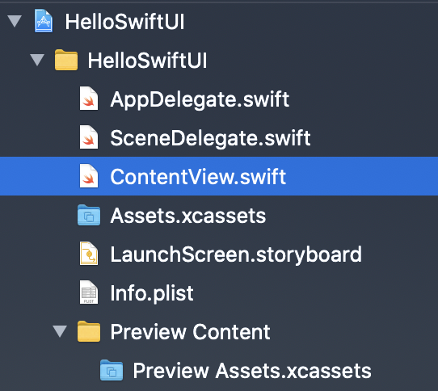

## SwiftUI 기본

우선은 `SwiftUI`를 공부하기 앞서서 `SwiftUI`의 기본 특성과 간단한 것에 대해 Overview를 살펴보겠습니다.

 

우선 기존에 `User Inferface`인 `Storyboard`를 대처하는 방법으로 나온 `SwiftUI`는 시뮬레이터를 실행하면서 화면의 요소를 확인해야했던 `Storyboard`의 단점을 어느정도는 보완해서 나온 방법입니다.

그렇다면 `SwiftUI`의 4가지 원칙을 알아보겠습니다.

* ***선언형*** : 명령형은 How에 초점이 맞추지만 선언형은 무엇을 할지에 초점을 맞춘다. 우리가 원하는 UI의 형태를 선언하기만하면 프레임워크에서 세부 구현 사항을 대신 처리해줍니다.
* ***자동화*** : SwiftUI 프레임워크가 기본적으로 선언형으로 작성되면서 많은 것들을 지원해줍니다.
* ***조합*** : 뷰와 API의 분리가 쉬워집니다. 그리고 더 작은 단위의 뷰를 만들어 더 큰 단위의 뷰를 만드는 것도 쉬워졌습니다.
* ***일관성*** : 데이터의 변화와 그에 맞게 뷰가 변하는 동기화는 앱에서 필수이다. 그러나 기존의 UIKit에서는 이것을 데이터에 맞게 수동으로 변경을 해주어야 했는데, SwiftUI에서는 데이터의 흐름에 따라 UI가 자동으로 변경된다. (<u>RxSwift가 인기 많은 이유와 동일하다.</u>)

 

### 직접 생성하기

우선 **Xcode**를 실행해서 기존과 같이 프로젝트를 생성해주는데 여기서 주의해야할 점이 기존에는 User Interface를 `Storyboard`로 생성했던 반면에 `SwiftUI`를 선택해서 생성해주어야한다.

생성하면 다음과 같은 폴더 구조를 가진다. 

여기서 가장 다른 점은 `ViewController.swift`, `Main.storyboard` 파일이 사라졌습니다. 그리고 `Preview Assets.xcassets`가 생성되었습니다.

그렇다면 각각의 생성된 파일들은 무슨 역할일까요?

* ***ContentView*** : `SwiftUI`에서는 `UIViewController`, `UIView`를 상속받은 뷰를 사용하는 것이 아닌 `View` 프로토콜을 준수하는 `ContentView`가 `UIViewController`를 대신하게 됩니다.
* ***Main.storyboard*** ***삭제*** : SwiftUI에서는 스토리보드를 사용할 필요없이 프리뷰라는 것을 시뮬레이터로 실행하지 않고도 개발한 화면을 확인할 수 있습니다.
* ***Preview Assets.xcassets 추가***  : Asset.xcassets도 기본적으로 존재하지만 하나가 더 추가되었습니다. 이것은 개발 과정에서만 사용할 별도의 애셋 파일입니다. 별도로 건드리지 않아도 무방한 파일입니다.

 

### 단축키

* ***Preview 실행하기*** : Option + Command + P (⌥⌘P) or 오른쪽 상단의 Resume 버튼 클릭하기
* ***Canvas (Preview 보기)*** : Option + Command + Enter (⌥⌘⏎)
* ***Inspector Bar 보기*** : Control + Option + Click (⌃⌥왼쪽)

 